# Low-Latency Apple FAQ Voice Bot

An English/Hindi Apple FAQ voice assistant built with Pipecat. The canonical entry point is the root [`main.py`](./main.py).

It uses streaming speech recognition, semantic end-of-turn detection, speculative LLM routing, and streamed speech synthesis to keep normal responses near the sub-second range while failing closed outside the approved FAQ scope.

## Quick start

Requires Python 3.11+ and API keys for Deepgram, Groq, and Cartesia.

```powershell
python -m venv .venv
.\.venv\Scripts\Activate.ps1
python -m pip install --upgrade pip
python -m pip install -r requirements.txt
Copy-Item .env.example .env
```

Set these values in `.env`:

```dotenv
DEEPGRAM_API_KEY=
GROQ_API_KEY=
CARTESIA_API_KEY=
CARTESIA_VOICE_ID=
```

Run the bot:

```powershell
.\.venv\Scripts\python.exe .\main.py
```

Open <http://localhost:7860>, start a WebRTC session, allow microphone access, and ask an Apple FAQ question.

## System architecture

```mermaid
flowchart LR
    mic([Browser microphone]) --> rtcIn[WebRTC input]

    subgraph turn[Turn detection and transcription]
        rtcIn --> vad[Silero VAD\nspeech activity]
        vad --> smart[Pipecat Local Smart Turn v3.2\nsemantic endpointing]
        smart --> stt[Deepgram Nova-3\nmultilingual streaming STT]
    end

    subgraph control[FAQ control plane]
        stt --> interim[Interim + final transcripts]
        interim --> controller[Streaming FAQ Controller]
        controller --> local{Local scope check}
        local -->|Other company / unrelated| refusal[Fixed safe refusal]
        local -->|Apple FAQ candidate| speculate[Speculative Groq request\nwhile the user speaks]
        speculate --> final[Final transcript +\nGroq GPT-OSS-20B]
        final --> protocol{OK or NO\nprotocol validation}
        protocol -->|OK| answer[Approved spoken answer]
        protocol -->|NO / invalid| refusal
    end

    subgraph speech[Speech output]
        answer --> tts[Cartesia Sonic 3.5\nsentence aggregation]
        refusal --> tts
        tts --> rtcOut[WebRTC output]
        rtcOut --> speaker([Browser speaker])
        answer -. completed text .-> ui[RTVI conversation UI]
        refusal -. completed text .-> ui
    end
```



### Turn flow

```text
User speaks
  -> Silero VAD detects speech
  -> Local Smart Turn decides whether the utterance is complete
  -> Deepgram Nova-3 produces interim/final multilingual transcript
  -> FAQ controller rejects obvious out-of-scope requests locally
  -> otherwise Groq GPT-OSS-20B generates a protocol-constrained FAQ response
  -> Cartesia Sonic 3.5 streams sentence-level speech
  -> WebRTC plays audio and RTVI shows the completed answer
```

## Stack

| Layer | Implementation |
| --- | --- |
| Voice transport | Pipecat local WebRTC development runner |
| Speech activity detection | Silero VAD |
| Semantic endpointing | Pipecat Local Smart Turn v3.2 (local ONNX model) |
| STT | Deepgram Nova-3, `language="multi"` |
| LLM | Groq `openai/gpt-oss-20b` |
| TTS | Cartesia Sonic 3.5, 24 kHz PCM |
| Answer languages | English, Hindi, or concise Hinglish |
| UI | Pipecat RTVI conversation UI |

## Endpointing

The script combines three complementary signals:

- **Silero VAD** detects whether the user is speaking.
- **Local Smart Turn v3.2** provides semantic endpointing: it distinguishes a complete question from a short pause within an utterance.
- **Deepgram endpointing** is configured to `100 ms` by default and finalizes STT segments quickly.

Smart Turn emits the user-turn stop event that commits the answer path. It is local, so it adds no network dependency.

## Guardrails

The bot is deliberately limited to the reviewed Apple FAQ knowledge embedded in `main.py`.

1. The system prompt permits only facts in the approved FAQ set.
2. A local regex gate immediately rejects competitors, coding requests, time/weather, prompt injection, and other clearly unrelated requests.
3. Groq must output `OK|<answer>` for a supported answer or `NO|` for a refusal.
4. The controller validates that prefix before anything reaches TTS. Invalid model output is blocked and replaced with a safe fallback.
5. Missing transcripts and provider failures return a controlled error response rather than an invented answer.

The refusal is automatically returned in Hindi when Devanagari text is detected; otherwise it is returned in English.

## Latency and telemetry

The terminal logs `RESPONSE LATENCY` for every response and emits a shutdown summary for **native end-of-turn → first bot audio**.

| Metric | Meaning |
| --- | --- |
| `native-EOT->bot-audio` | Main response metric: server-side time from semantic turn completion to first audible bot audio |
| `raw-audio->native-EOT` | Estimated final voiced audio to semantic end-of-turn decision |
| `raw-audio->bot-audio` | Estimated final voiced audio to first bot audio |
| `LLM-TTFT` | LLM time to first text token; a negative value means speculative work began before end-of-turn |
| `native-EOT->TTS-audio` | Semantic end-of-turn to first TTS audio |
| `Cartesia TTFB` | Cartesia request to first audio byte |
| `Cartesia TTFA` | Cartesia request to first audible audio frame, including leading silence |

Example results from a recent 11-turn local run:

| Measurement | Result |
| --- | ---: |
| EOT → first bot audio p50 | 667 ms |
| EOT → first bot audio p90 | 892 ms |
| EOT → first bot audio p95 / max | 1424 ms |
| Deepgram STT TTFB | ~515–592 ms |
| Cartesia TTS TTFB | ~95–129 ms |
| Cartesia TTFA | ~184–316 ms |

`p50` means half of measured turns were at or below that value. A p99 should only be assessed with a much larger test set (hundreds of turns); with 11 turns it would just approximate the slowest observed request.

## Configuration

All settings below are optional unless marked required.

| Variable | Default | Purpose |
| --- | --- | --- |
| `DEEPGRAM_API_KEY` | required | Deepgram authentication |
| `GROQ_API_KEY` | required | Groq authentication |
| `CARTESIA_API_KEY` | required | Cartesia authentication |
| `CARTESIA_VOICE_ID` | required | Cartesia voice to use |
| `LLM_MODEL` | `openai/gpt-oss-20b` | Groq model |
| `LLM_MAX_TOKENS` | `180` | Completion-token budget |
| `DEEPGRAM_ENDPOINTING_MS` | `100` | Deepgram silence endpointing threshold |
| `SPECULATION_ENABLED` | `true` | Start safe LLM work from interim STT text |
| `SPECULATION_DEBOUNCE_MS` | `80` | Delay before launching speculative work |
| `SPECULATION_MIN_WORDS` | `3` | Minimum words required for speculation |
| `SPECULATION_MIN_CHARS` | `12` | Minimum characters required for speculation |
| `SPECULATION_MAX_RESTARTS` | `2` | Max speculative request restarts per turn |
| `CARTESIA_MODEL` | `sonic-3.5` | Cartesia speech model |

## Repository layout

```text
main.py                    Current streaming root implementation
old-architecture/          Earlier reference implementation
revamped-architecture/     Separate cache/local-router experiments
.env.example               Required keys and optional configuration
requirements.txt           Python dependencies
```

`old-architecture/` and `revamped-architecture/` are retained for comparison; they are not used by root `main.py`.
